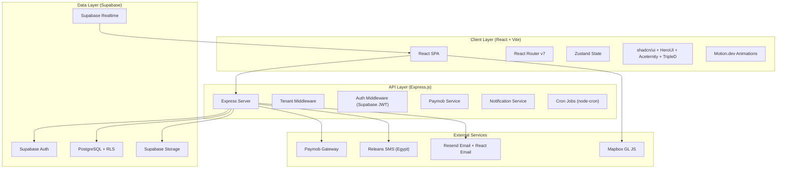
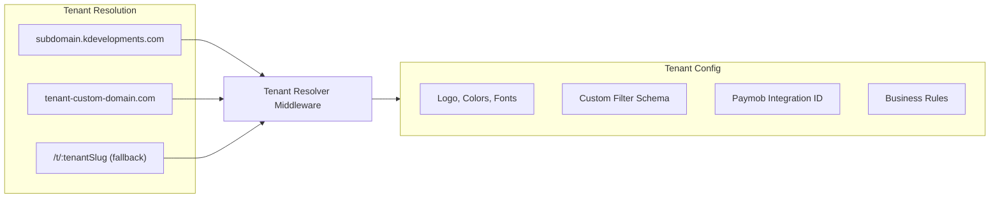
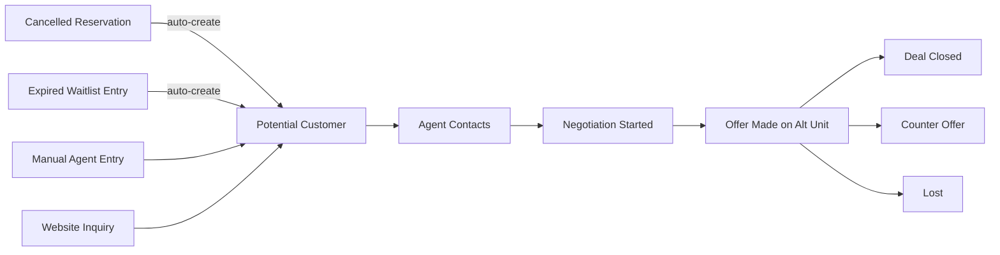
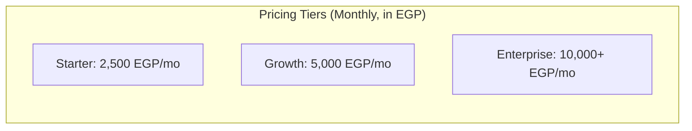

# K-Developments Multi-Tenant Real Estate SaaS Platform

## Architecture Overview



---

## 1. Tech Stack Decisions

### Frontend
- **React 19 + Vite 6** -- SPA, no SSR needed
- **React Router v7** -- client-side routing with nested layouts
- **Zustand** -- lightweight state management
- **TanStack Query (React Query)** -- server state, caching, optimistic updates
- **shadcn/ui** -- base component system (accessible, composable, Tailwind-based)
- **HeroUI** -- polished data tables, modals, dropdowns
- **Aceternity UI** -- hero sections, animated cards, spotlight effects for landing pages
- **TripleD UI** -- specialized components (browse their library for map cards, filter panels)
- **Motion.dev (motion/react)** -- all animations (page transitions, layout animations, scroll-triggered, gesture)
- **Tailwind CSS v4** -- utility-first styling + CSS variables for tenant theming
- **Mapbox GL JS + react-map-gl** -- Google-quality interactive maps (WebGL, satellite, 3D buildings, geocoding, 50k free loads/month)
- **Recharts** -- dashboard charts (line, bar, pie)
- **react-hook-form + zod** -- form handling and validation
- **date-fns** -- date utilities
- **react-pdf** -- PDF generation (receipts, contracts)

### Backend
- **Express.js** -- API server
- **Supabase JS Client (server-side)** -- database operations with service role key
- **Supabase Auth** -- JWT-based auth, RLS enforcement
- **node-cron** -- scheduled jobs (payment reminders, waitlist timers)
- **multer** -- file upload handling before pushing to Supabase Storage
- **helmet + cors + rate-limit** -- security middleware
- **winston** -- structured logging
- **zod** -- request validation
- **resend** -- email API with React Email templates
- **releans / HTTP SMS API** -- Egypt-local SMS at $0.0255/message

### Database (All Logic in Source Code)
All Supabase schema lives in the project repo, not managed from the dashboard:
- `supabase/migrations/` -- numbered SQL migration files for every table, index, enum, trigger
- `supabase/seed.sql` -- demo data for development
- `supabase/functions/` -- Edge Functions (if needed)
- RLS policies defined in migration files, version-controlled
- Use `supabase db push` / `supabase db reset` for local dev
- Use `supabase migration up` for production deploys
- All database types auto-generated via `supabase gen types typescript`

### Infrastructure
- **Supabase** -- PostgreSQL, Auth, Storage, Realtime subscriptions
- **Paymob** -- payment gateway (per-tenant Integration IDs via Marketplace)
- **Releans** -- SMS notifications for Egypt ($0.0255/msg local rate)
- **Resend** -- email notifications (3,000 free/mo, then $20/mo for 50k)
- **Vercel** -- frontend deployment
- **Railway / Render** -- Express backend deployment
- **Cloudflare** -- CDN + custom domain routing per tenant

---

## 2. Multi-Tenancy Strategy

### Approach: Shared Database with Row-Level Security (RLS)

Every table includes a `tenant_id` column. Supabase RLS policies ensure data isolation.



- **Tenant resolution**: subdomain-based (`acme.platform.com`) with custom domain support
- **Branding**: each tenant stores `theme_config` JSON (primary color, secondary color, logo URL, favicon, font family) -- injected as CSS custom properties at runtime
- **Filter criteria**: each tenant defines their own `filter_schema` JSON (which filters to show, which values, labels in their language)

---

## 3. Database Schema (Supabase PostgreSQL)

### Core Tables

**tenants**
- `id`, `name`, `slug`, `custom_domain`, `logo_url`, `favicon_url`, `theme_config` (JSONB: primary_color, secondary_color, accent_color, font_family), `filter_schema` (JSONB), `paymob_integration_id`, `paymob_api_key`, `contact_phone`, `contact_email`, `address`, `status`, `created_at`

**users**
- `id` (FK to Supabase auth.users), `tenant_id`, `role` (enum: super_admin, admin, manager, agent, customer), `full_name`, `phone`, `email`, `national_id`, `avatar_url`, `is_active`, `created_at`

**projects**
- `id`, `tenant_id`, `name`, `description`, `location_lat`, `location_lng`, `address`, `total_units`, `amenities` (JSONB), `cover_image_url`, `gallery` (JSONB array), `status`, `created_at`

**buildings**
- `id`, `tenant_id`, `project_id`, `name`, `number`, `total_floors`, `total_units`, `location_lat`, `location_lng`, `created_at`

**units**
- `id`, `tenant_id`, `project_id`, `building_id`, `unit_number`, `floor`, `type` (enum), `bedrooms`, `bathrooms`, `balconies`, `size_sqm`, `view_type`, `finishing`, `has_garden`, `garden_size`, `price`, `reservation_fee`, `down_payment_pct`, `installment_months`, `status` (available/reserved/sold), `gallery` (JSONB), `floor_plan_url`, `virtual_tour_url`, `custom_attributes` (JSONB for tenant-specific fields), `created_at`

**reservations**
- `id`, `tenant_id`, `unit_id`, `customer_id`, `agent_id`, `confirmation_number`, `status` (pending/confirmed/cancelled/expired), `total_price`, `reservation_fee_paid`, `payment_method`, `paymob_transaction_id`, `notes`, `created_at`, `confirmed_at`, `cancelled_at`

**waiting_list**
- `id`, `tenant_id`, `unit_id`, `customer_id`, `position`, `status` (active/notified/converted/expired/removed), `notification_prefs` (JSONB), `notified_at`, `expires_at`, `created_at`

**payments**
- `id`, `tenant_id`, `reservation_id`, `customer_id`, `type` (reservation_fee/down_payment/installment), `amount`, `due_date`, `status` (pending/paid/overdue/failed), `paymob_transaction_id`, `paid_at`, `receipt_url`, `created_at`

**potential_customers** (NEW FEATURE)
- `id`, `tenant_id`, `customer_id` (nullable, FK to users), `name`, `phone`, `email`, `source` (reservation_cancelled/waitlist_expired/inquiry/referral), `source_reservation_id`, `interested_unit_types` (JSONB), `budget_min`, `budget_max`, `preferred_locations` (JSONB), `negotiation_status` (new/contacted/negotiating/offer_made/accepted/rejected/lost), `assigned_agent_id`, `notes`, `last_contact_at`, `next_followup_at`, `created_at`

**negotiations** (linked to potential_customers)
- `id`, `tenant_id`, `potential_customer_id`, `unit_id`, `offered_price`, `counter_price`, `discount_pct`, `special_terms`, `status` (pending/accepted/rejected/countered), `created_by`, `created_at`

**follow_ups**
- `id`, `tenant_id`, `agent_id`, `customer_id`, `potential_customer_id`, `type` (call/visit/message/email), `scheduled_at`, `completed_at`, `notes`, `outcome`, `created_at`

**activity_logs**
- `id`, `tenant_id`, `user_id`, `action`, `entity_type`, `entity_id`, `details` (JSONB), `ip_address`, `created_at`

**notifications**
- `id`, `tenant_id`, `user_id`, `type`, `title`, `message`, `channel` (sms/email/push/in_app), `status` (pending/sent/failed/read), `sent_at`, `read_at`, `created_at`

**documents**
- `id`, `tenant_id`, `user_id`, `reservation_id`, `type` (national_id/proof_of_address/contract/receipt), `file_url`, `status` (pending/approved/rejected), `reviewed_by`, `created_at`

---

## 4. Tenant-Specific Filter System

Instead of hardcoded filters, each tenant defines a `filter_schema` in their config:

```json
{
  "filters": [
    {
      "key": "service_type",
      "label": "Engineering and Construction",
      "type": "dropdown",
      "options": ["Engineering", "Construction", "Consulting"],
      "default": "all"
    },
    {
      "key": "sector",
      "label": "All Sectors",
      "type": "dropdown",
      "options": ["Residential", "Commercial", "Industrial"],
      "default": "all"
    },
    {
      "key": "location",
      "label": "All Locations",
      "type": "dropdown",
      "options": ["Cairo", "Alexandria", "Shorouk"],
      "default": "all"
    }
  ],
  "has_search": true,
  "has_map_view": true,
  "has_clear_button": true
}
```

The React filter bar component reads this schema dynamically and renders the correct filter controls per tenant. The filter bar UI matches the screenshots provided: horizontal bar with dropdowns + search + clear button on desktop, slide-up panel on mobile.

---

## 5. Potential Customer Pipeline (New Feature)



When a reservation is cancelled or a waitlist entry expires, the system auto-creates a potential customer record with their preferences (unit type, budget, location). Agents see a "Leads" tab in their dashboard with these potential customers, can start negotiations, offer alternative units at negotiated prices, and track the full pipeline.

---

## 6. Payment Architecture (Paymob Per-Tenant)

Each tenant must register their own Paymob merchant account and provide their `Integration ID` + `API Key` during onboarding. The platform stores these securely (encrypted at rest).

**Flow:**
1. Customer clicks "Pay" -> Frontend calls Express API
2. Express reads tenant's Paymob credentials from DB
3. Express creates Paymob Intention using tenant's API key and Integration ID
4. Customer pays on Paymob checkout (redirect or embedded Pixel)
5. Paymob sends webhook to Express -> Express verifies HMAC -> updates reservation status
6. Money goes directly to the tenant's Paymob-linked bank account

This means each tenant receives their own money directly -- the platform never touches tenant funds.

---

## 7. Frontend App Structure (150-Line Files)

Every file stays under 150 lines. Components are split by concern, hooks extract logic, types are separate.

```
client/src/
  app/
    router.tsx                  # React Router config, lazy routes (~80 lines)
    providers.tsx               # QueryClient + Zustand + i18n + Theme wrappers (~50 lines)
    layouts/
      public-layout.tsx         # Navbar + footer, tenant-branded (~60 lines)
      auth-layout.tsx           # Centered card layout (~30 lines)
      dashboard-layout.tsx      # Sidebar + header + content shell (~80 lines)
      customer-layout.tsx       # Customer sidebar nav items (~40 lines)
      agent-layout.tsx          # Agent sidebar nav items (~40 lines)
      manager-layout.tsx        # Manager sidebar nav items (~40 lines)
      admin-layout.tsx          # Admin sidebar nav items (~40 lines)
  features/
    auth/
      pages/
        login-page.tsx          # (~80 lines)
        register-page.tsx       # (~90 lines)
        forgot-password-page.tsx # (~60 lines)
      hooks/
        use-auth.ts             # login, logout, session (~70 lines)
        use-current-user.ts     # profile + role (~40 lines)
      components/
        login-form.tsx          # (~80 lines)
        register-form.tsx       # (~100 lines)
        protected-route.tsx     # role-based guard (~30 lines)
    landing/
      pages/
        landing-page.tsx        # Composes sections (~50 lines)
      components/
        hero-section.tsx        # Aceternity spotlight + stats (~100 lines)
        amenities-section.tsx   # Icon grid + Motion.dev reveal (~80 lines)
        location-section.tsx    # Mapbox static map embed (~60 lines)
        contact-section.tsx     # Phone, WhatsApp, inquiry form (~80 lines)
        footer.tsx              # Tenant-branded footer (~50 lines)
    browse/
      pages/
        browse-page.tsx         # Composes filter + grid/map (~60 lines)
      components/
        filter-bar.tsx          # Dynamic from tenant schema (~100 lines)
        filter-bar.skeleton.tsx # (~20 lines)
        filter-panel-mobile.tsx # Sheet bottom drawer (~80 lines)
        unit-card.tsx           # Card with photo, details, badge (~70 lines)
        unit-card.skeleton.tsx  # (~20 lines)
        unit-grid.tsx           # Responsive grid + infinite scroll (~50 lines)
        map-view.tsx            # react-map-gl + markers (~120 lines)
        map-marker-popup.tsx    # Popup content on click (~50 lines)
        search-bar.tsx          # Debounced input (~40 lines)
        view-toggle.tsx         # List/Map toggle button (~30 lines)
      hooks/
        use-unit-filters.ts     # Filter state + URL sync (~80 lines)
        use-units-query.ts      # TanStack Query paginated (~50 lines)
        use-map-bounds.ts       # Visible map area tracking (~40 lines)
      types.ts                  # BrowseFilter, UnitCardProps (~30 lines)
    unit-details/
      pages/
        unit-detail-page.tsx    # Composes sections (~60 lines)
      components/
        photo-gallery.tsx       # Swipeable gallery (~100 lines)
        pricing-section.tsx     # Price breakdown + calculator (~90 lines)
        payment-calculator.tsx  # Interactive sliders (~80 lines)
        detail-info.tsx         # Unit specs table (~60 lines)
        action-buttons.tsx      # Reserve / Waitlist / Share (~50 lines)
        share-modal.tsx         # WhatsApp, FB, copy link (~50 lines)
        schedule-visit-modal.tsx # Date/time picker form (~80 lines)
      hooks/
        use-unit-detail.ts      # Fetch single unit (~40 lines)
    reservation/
      pages/
        checkout-page.tsx       # Summary + form + payment (~60 lines)
        success-page.tsx        # Confetti + confirmation (~70 lines)
        failure-page.tsx        # Error + retry (~50 lines)
      components/
        checkout-form.tsx       # Customer info form (~100 lines)
        payment-method-select.tsx # Card/Fawry/VodaCash/Bank (~70 lines)
        unit-summary-card.tsx   # Selected unit recap (~40 lines)
      hooks/
        use-create-reservation.ts # Mutation hook (~60 lines)
    waiting-list/               # Components + hooks for waitlist features
    customer-dashboard/         # Customer portal pages + components
    agent-dashboard/            # Agent CRM pages + components
    potential-customers/        # Lead pipeline + negotiation
    manager-dashboard/          # Manager analytics + management
    admin-dashboard/            # Tenant + user management
    tenant-settings/            # Branding, filters, Paymob config
    notifications/              # Bell, list, preferences
    reports/                    # Charts, table, export
  components/
    ui/                         # shadcn/ui components (auto-generated)
    shared/
      data-table.tsx            # Reusable table with sort/filter/pagination (~120 lines)
      empty-state.tsx           # Illustration + message + CTA (~40 lines)
      confirm-dialog.tsx        # Destructive action confirmation (~50 lines)
      status-badge.tsx          # Color-coded status badges (~30 lines)
      file-upload.tsx           # Drag-drop zone + preview (~100 lines)
      currency-display.tsx      # EGP formatted display (~20 lines)
      phone-input.tsx           # Egypt +20 formatted input (~50 lines)
      page-header.tsx           # Breadcrumb + title + actions (~40 lines)
      loading-skeleton.tsx      # Generic skeleton builder (~30 lines)
    motion/
      page-transition.tsx       # Fade+slide on route change (~30 lines)
      fade-in-view.tsx          # whileInView wrapper (~20 lines)
      stagger-children.tsx      # Staggered child animation (~25 lines)
  hooks/
    use-tenant.ts               # Tenant resolution + config (~60 lines)
    use-tenant-theme.ts         # CSS variable injection (~40 lines)
    use-debounce.ts             # Debounce hook (~15 lines)
    use-infinite-scroll.ts      # Intersection observer (~30 lines)
    use-media-query.ts          # Responsive breakpoint hook (~20 lines)
  lib/
    api.ts                      # Axios instance, tenant header, auth interceptor (~50 lines)
    supabase.ts                 # Supabase client init (~15 lines)
    format.ts                   # Currency, date, phone formatters (~40 lines)
    seo.ts                      # JSON-LD schema generators (~40 lines)
  stores/
    auth.store.ts               # User session state (~40 lines)
    tenant.store.ts             # Tenant config + theme (~50 lines)
    ui.store.ts                 # Sidebar open, language, dark mode (~30 lines)
  i18n/
    config.ts                   # i18next init + language detection (~30 lines)
    ar/
      common.json               # Shared Arabic translations
      browse.json               # Browse feature translations
      dashboard.json            # Dashboard translations
    en/
      common.json               # Shared English translations
      browse.json
      dashboard.json
  types/
    database.types.ts           # Auto-generated from Supabase (read-only)
    api.types.ts                # API request/response types (~60 lines)
    tenant.types.ts             # Tenant config, filter schema types (~40 lines)
  styles/
    globals.css                 # Tailwind base + CSS variables + RTL utilities (~60 lines)
```

---

## 8. Backend API Structure

```
server/
  src/
    index.ts                   # Express app entry
    config/
      supabase.ts              # Supabase admin client (service role)
      paymob.ts                # Paymob config
    middleware/
      auth.ts                  # JWT verification via Supabase
      tenant.ts                # Tenant resolution from header/subdomain
      rbac.ts                  # Role-based access control
      rateLimit.ts
      errorHandler.ts
    routes/
      auth.routes.ts
      tenants.routes.ts
      projects.routes.ts
      units.routes.ts
      reservations.routes.ts
      waitingList.routes.ts
      payments.routes.ts
      potentialCustomers.routes.ts
      negotiations.routes.ts
      followUps.routes.ts
      notifications.routes.ts
      reports.routes.ts
      documents.routes.ts
      activityLogs.routes.ts
    services/
      tenant.service.ts
      unit.service.ts
      reservation.service.ts
      waitingList.service.ts
      payment.service.ts
      paymob.service.ts        # Paymob API integration
      notification.service.ts  # SMS (Releans) + Email (Resend) + In-app
      potentialCustomer.service.ts
      negotiation.service.ts
      report.service.ts
      pdf.service.ts           # Receipt/contract generation
    jobs/
      paymentReminders.ts      # 7-day, 1-day, overdue reminders
      waitlistTimer.ts         # 24-hour expiration check
      dailySummary.ts          # Morning summary for managers
      leadGeneration.ts        # Auto-create potential customers
    emails/                    # React Email templates
      ReservationConfirm.tsx
      PaymentReminder.tsx
      WaitlistNotify.tsx
      WelcomeEmail.tsx
      DailySummary.tsx
    utils/
      hmac.ts                  # Paymob webhook verification
      encryption.ts            # Encrypt tenant API keys
```

### Supabase Source Code Structure (All DB Logic in Repo)

```
supabase/
  config.toml                  # Supabase project config
  migrations/
    00001_create_enums.sql     # Role, status, payment enums
    00002_create_tenants.sql   # Tenants table + RLS
    00003_create_users.sql     # Users table + RLS
    00004_create_projects.sql  # Projects + buildings
    00005_create_units.sql     # Units table + indexes + RLS
    00006_create_reservations.sql
    00007_create_waiting_list.sql
    00008_create_payments.sql
    00009_create_potential_customers.sql
    00010_create_negotiations.sql
    00011_create_follow_ups.sql
    00012_create_notifications.sql
    00013_create_documents.sql
    00014_create_activity_logs.sql
    00015_create_rls_policies.sql   # All RLS policies in one place
    00016_create_functions.sql      # DB functions (auto-position waitlist, etc.)
    00017_create_triggers.sql       # Auto-log, auto-notify triggers
    00018_create_indexes.sql        # Performance indexes
  seed.sql                     # Demo tenant + sample data
  .env.local                   # Local Supabase credentials (gitignored)
```

Every schema change is a new migration file. `supabase gen types typescript` outputs `src/types/database.types.ts` for full type safety across frontend and backend.

---

## 9. Implementation Phases (Production-Grade, Line 0 to Launch)

Every task is scoped for AI implementation: each produces files under 150 lines, has clear inputs/outputs, and can be verified independently.

### PHASE 0: Project Scaffolding (Foundation) -- "Line 0"
0.1. Create monorepo structure: `/client` (Vite + React), `/server` (Express), `/supabase` (migrations)
0.2. Initialize `/client`: Vite + React 19 + TypeScript, `@/` path alias in `vite.config.ts`
0.3. Install client deps: `react-router`, `zustand`, `@tanstack/react-query`, `motion`, `react-hook-form`, `zod`, `date-fns`, `react-i18next`, `react-helmet-async`, `axios`, `react-map-gl`, `mapbox-gl`, `recharts`
0.4. Install + configure Tailwind CSS v4 with CSS variable theming in `globals.css`
0.5. Install + configure shadcn/ui (init, add Button, Input, Dialog, Sheet, Dropdown, Table, Card, Badge, Skeleton, Toast, Tabs)
0.6. Create `cn()` utility (clsx + tailwind-merge)
0.7. Set up React Router v7: `router.tsx` with nested layout routes, lazy-loaded pages
0.8. Set up Zustand stores: `auth.store.ts`, `tenant.store.ts`, `ui.store.ts` (each under 60 lines)
0.9. Set up TanStack Query provider with default config (stale time, retry, error handling)
0.10. Set up i18n: `react-i18next`, `ar.json` + `en.json` translation files per feature, RTL toggle
0.11. Initialize `/server`: Express + TypeScript, `tsconfig.json`, `nodemon` for dev
0.12. Install server deps: `express`, `cors`, `helmet`, `express-rate-limit`, `@supabase/supabase-js`, `resend`, `zod`, `winston`, `node-cron`, `multer`, `pdfkit`, `crypto` (for HMAC)
0.13. Set up Express app: entry point, middleware stack (cors, helmet, rate-limit, JSON parser, error handler)
0.14. Create standard API response helpers: `sendSuccess()`, `sendError()`, error code constants
0.15. Initialize Supabase project: `supabase init`, `config.toml`, `.env.local` (gitignored)
0.16. Write all migration files (00001 through 00018) -- one table per file, indexes, RLS enabled
0.17. Write RLS policies migration: tenant isolation on every table
0.18. Write DB functions migration: `auto_position_waitlist()`, `generate_confirmation_number()`
0.19. Write DB triggers migration: `log_activity_trigger`, `update_unit_status_on_reservation`
0.20. Write `seed.sql`: demo tenant (K-Developments), 3 buildings, 20 units, 5 users (1 per role), sample reservations
0.21. Run `supabase gen types typescript` -> output to `client/src/types/database.types.ts` and `server/src/types/database.types.ts`
0.22. Create `.cursor/rules/` directory with all 5 rule files (general, react-components, api-routes, supabase, styling)
0.23. Create `PROGRESS.md` at project root with full task checklist
0.24. Create `.env.example` files for client and server with all required env vars documented

### PHASE 1: Auth + Tenant System
1.1. Supabase Auth: signup with email+password, login, password reset, email verification
1.2. Auth pages: `login-page.tsx`, `register-page.tsx`, `forgot-password-page.tsx`, `reset-password-page.tsx` (each under 100 lines)
1.3. Auth hooks: `use-auth.ts` (login, logout, session), `use-current-user.ts` (profile + role)
1.4. Tenant resolution: Express middleware reads `x-tenant-slug` header or parses subdomain from `Host`
1.5. Client-side tenant resolution: `use-tenant.ts` hook extracts slug from URL, fetches tenant config
1.6. Tenant branding: `tenant-theme-provider.tsx` injects CSS variables (`--color-primary`, etc.) from tenant config
1.7. Tenant favicon + logo swap: dynamic `<link rel="icon">` and logo component reads from tenant store
1.8. RBAC middleware (server): `rbac.ts` checks user role against route permission, returns 403 if denied
1.9. Protected routes (client): `<ProtectedRoute role={['manager', 'admin']} />` wrapper component
1.10. Layout routes: `PublicLayout`, `AuthLayout`, `CustomerLayout`, `AgentLayout`, `ManagerLayout`, `AdminLayout`
1.11. User profile page: view/edit name, phone, email, avatar upload
1.12. RTL layout: detect language, set `dir="rtl"` on `<html>`, Tailwind RTL classes activate

### PHASE 2: Public-Facing Pages (Customer Journey Start)
2.1. Landing page hero: Aceternity spotlight effect, project name, stats counter (animated numbers), CTA buttons
2.2. Landing amenities section: icon grid (gym, security, mall, schools), scroll-triggered fade-in via Motion.dev
2.3. Landing location section: embedded Mapbox static map, address, distance to landmarks
2.4. Landing contact section: phone (click-to-call), WhatsApp button, inquiry form
2.5. Landing footer: tenant-branded, social links, legal links
2.6. Browse page layout: `browse-page.tsx` composes FilterBar + ViewToggle + UnitGrid/MapView
2.7. Dynamic FilterBar: reads `tenant.filter_schema`, renders dropdowns/range sliders/checkboxes dynamically
2.8. FilterBar desktop: horizontal bar matching screenshot style (dropdowns inline, search, clear button)
2.9. FilterPanel mobile: shadcn Sheet sliding up from bottom, same filters in vertical stack
2.10. SearchBar: debounced 300ms, searches unit number, building name, description
2.11. UnitCard: photo, unit number, size, bedrooms, price, status badge (Available green / Reserved amber / Sold gray)
2.12. UnitCard skeleton: shimmer loading card
2.13. UnitGrid: responsive grid (1 col mobile, 2 tablet, 3 desktop), infinite scroll with TanStack Query
2.14. ViewToggle: List/Map toggle button with Motion.dev layout animation on switch
2.15. MapView: Mapbox GL JS via react-map-gl, unit markers color-coded by status
2.16. MapView popups: click marker -> popup with unit photo, price, status, "View Details" link
2.17. MapView filter sync: filters applied in grid also filter map markers
2.18. MapView satellite toggle: button to switch between street and satellite view
2.19. Unit detail page: photo gallery (swipeable on mobile), floor plan viewer, 360 tour iframe
2.20. Unit detail pricing section: total price, reservation fee, down payment, installment breakdown
2.21. Payment calculator: interactive sliders for down payment % and installment years, live monthly payment update
2.22. Unit detail actions: "Reserve Now" (if available), "Join Waiting List" (if reserved/sold), share, download floor plan
2.23. Share component: WhatsApp (deep link), Facebook, copy link, native Web Share API on mobile
2.24. Schedule visit modal: date picker, time slots, phone number, submit -> creates follow-up for agent
2.25. SEO: react-helmet-async on landing + browse + unit detail pages, JSON-LD RealEstateListing schema

### PHASE 3: Reservation + Payment
3.1. Checkout page layout: unit summary card + customer form + payment method selector
3.2. Customer info form: full name, phone (+20 format), email, national ID, terms checkbox -- zod validated
3.3. Payment method selector: card icons (Visa, MC), Fawry logo, Vodafone Cash, bank transfer
3.4. Paymob service (server): `paymob.service.ts` -- authenticate, create intention, generate payment key using tenant's credentials
3.5. Paymob checkout: redirect to Paymob hosted page or embed Pixel component
3.6. Paymob webhook handler: `POST /api/v1/webhooks/paymob` -- verify HMAC, update reservation status, create payment record
3.7. Success page: confetti animation (Motion.dev), confirmation number, receipt download, "We'll call you within 24h"
3.8. Failure page: error message, "Try Again" button, "Try Different Method" button
3.9. Receipt PDF: generate via pdfkit on server, store in Supabase Storage, return URL
3.10. Bank transfer flow: customer selects bank transfer -> shown bank details + reference number -> uploads receipt -> agent verifies manually
3.11. Reservation status machine: pending -> payment_processing -> confirmed / failed; confirmed -> cancelled (by manager)
3.12. Auto-assign agent: on confirmed reservation, round-robin assign to next available agent, notify agent
3.13. Post-reservation notifications: SMS (Releans) + Email (Resend) to customer and agent

### PHASE 4: Waiting List System
4.1. "Join Waiting List" modal: triggered when status is reserved/sold, form with notification prefs (SMS checkbox, email checkbox)
4.2. Waitlist position display: "You are #3 of 12", estimated wait time
4.3. Waitlist API: `POST /waitlist` (join), `GET /waitlist/my` (customer's lists), `DELETE /waitlist/:id` (remove self)
4.4. Waitlist position auto-calculation: DB function assigns next position on insert
4.5. 24-hour timer cron: runs every minute, checks `expires_at` for notified entries, cascades to next if expired
4.6. Cascade notification: when current notified person expires, system auto-notifies next in line
4.7. Customer waitlist card: in dashboard, shows position, progress bar, countdown timer (if notified)
4.8. Manager waitlist view: table of all waitlists per unit, manual actions (notify, move up, remove)

### PHASE 5: Customer Dashboard
5.1. Dashboard layout: sidebar nav (Overview, Payments, Waitlist, Documents, Messages, Notifications)
5.2. Overview page: reservation summary card, next payment due card, assigned agent card
5.3. Payment schedule page: table with all payments (reservation fee, down payment, installments), status badges, "Pay Now" button for due/overdue
5.4. Pay installment flow: reuse Paymob checkout for installment payments
5.5. Payment history: list of all completed payments with receipt download links
5.6. Waitlist page: list of all units customer is waiting for, position, status, remove button
5.7. Documents page: upload zone (drag-and-drop), file type selector, preview thumbnail, status (pending/approved/rejected)
5.8. Messages page: simple chat-like interface with assigned agent (stored as follow-up notes)
5.9. Notification center: in-app notification bell with dropdown, unread count badge, mark as read
5.10. Mobile bottom navigation: Overview, Payments, Waitlist, Notifications, Profile

### PHASE 6: Agent Dashboard + CRM
6.1. Agent layout: sidebar nav (Overview, Customers, Follow-ups, Reservations, Leads, Performance)
6.2. Overview page: today's tasks card (calls, visits, docs to review), monthly performance card (sales, target, commission)
6.3. Customer list page: searchable table, filter by status, click to view profile
6.4. Customer profile page: tabs (Info, Reservation, Payments, Documents, Follow-ups, Notes)
6.5. Customer timeline: chronological list of all events (reservation, payments, follow-ups, doc uploads)
6.6. Follow-up creation: type (call/visit/message), date/time, notes -> auto-creates scheduled follow-up
6.7. Follow-up completion: mark as done, record outcome, optionally schedule next
6.8. Today's follow-ups: prioritized list with quick action buttons (call, complete, reschedule)
6.9. Bank transfer verification: view uploaded receipt image, approve/reject payment
6.10. Commission tracking: earned this month, total earned, pending payout, target progress bar
6.11. Reservation list: all reservations by this agent, filter by status/date, export to CSV

### PHASE 7: Potential Customer Pipeline
7.1. Auto-create lead from cancelled reservation: DB trigger on reservation status change to cancelled
7.2. Auto-create lead from expired waitlist: cron job detects final expiry (all positions exhausted for a customer)
7.3. Manual lead creation: agent form to add walk-in or phone inquiry leads
7.4. Leads kanban board: columns (New, Contacted, Negotiating, Offer Made, Accepted, Lost) -- drag-and-drop
7.5. Lead detail page: customer info, source info, interested unit types, budget, assigned agent, negotiation history
7.6. Start negotiation: agent selects alternative unit, enters offered price, discount %, special terms
7.7. Negotiation history: timeline of all offers/counter-offers per lead
7.8. Convert lead to reservation: one-click converts accepted negotiation to checkout flow with pre-filled data
7.9. Lead analytics: source breakdown chart, conversion rate, avg negotiation time

### PHASE 8: Manager Dashboard
8.1. Manager layout: sidebar nav (Dashboard, Units, Agents, Reservations, Waitlists, Leads, Reports, Settings)
8.2. KPI cards: total units, available count, reserved count, sold count, revenue this month, pending payments
8.3. Sales chart: Recharts line chart, monthly sales trend, filter by date range
8.4. Units by status chart: pie chart (available %, reserved %, sold %)
8.5. Agent performance chart: bar chart comparing agents by sales count
8.6. Units management: data table (search, filter by building/status/type), inline status toggle
8.7. Add/edit unit form: multi-step (details -> pricing -> photos -> publish), image upload with drag-reorder
8.8. Bulk unit import: CSV upload for mass unit creation
8.9. Agent management: table of agents, assign/reassign customers, set monthly targets
8.10. Reservations management: table with approve/reject/cancel actions, extend payment deadline modal
8.11. Refund processing: cancel reservation -> trigger Paymob refund API -> track refund status
8.12. Discount management: set per-unit discount, promotional pricing with start/end dates
8.13. Reports page: tabbed (Sales, Financial, Inventory, Agent Performance, Customer) with date filters
8.14. Report export: PDF via pdfkit, Excel via xlsx library, download buttons
8.15. Low inventory alert: auto-generated when building drops below configurable threshold

### PHASE 9: Admin + Super Admin Dashboard
9.1. Tenant onboarding wizard: 5 steps (Company Info -> Branding -> Paymob Setup -> Create Project -> Add Units)
9.2. Tenant management table: all tenants with status, plan tier, usage stats, actions (edit, suspend, delete)
9.3. User management: CRUD for managers and agents, role assignment, enable/disable
9.4. Activity logs viewer: filterable table (by user, action type, entity, date range), infinite scroll
9.5. System settings: reservation fee default, installment terms, notification channels, maintenance mode
9.6. Platform billing: track which tenants are on which plan, subscription status (use Stripe or manual invoicing initially)
9.7. Global analytics (super admin only): total tenants, total units across platform, total revenue, growth chart

### PHASE 10: Notification System
10.1. Notification service (server): unified `notification.service.ts` that dispatches to SMS/Email/In-app based on prefs
10.2. Releans SMS integration: HTTP POST to Releans API, handle delivery receipts
10.3. Resend email integration: `resend.emails.send()` with React Email templates
10.4. React Email templates: `ReservationConfirm.tsx`, `PaymentReminder.tsx`, `WaitlistNotify.tsx`, `WelcomeEmail.tsx`, `DailySummary.tsx` -- tenant-branded (logo, colors injected)
10.5. In-app notifications: Supabase Realtime subscription on `notifications` table, insert triggers push to frontend
10.6. Notification bell component: badge with unread count, dropdown list, mark as read
10.7. Payment reminder cron: runs daily at 9 AM, sends reminders for 7-day, 1-day, due-today, 1-day-overdue
10.8. Waitlist notification cron: runs every minute, handles 24h expiry cascade
10.9. Daily summary cron: runs at 9 AM, sends manager email with yesterday's stats
10.10. Notification preferences: customer can toggle SMS/Email per notification type in settings

### PHASE 11: Tenant Customization
11.1. Tenant settings page: tabbed (Branding, Filters, Payments, Notifications, Domain)
11.2. Branding tab: logo upload (with preview), color pickers (primary, secondary, accent), font selector, favicon upload
11.3. Color contrast validation: warn if selected colors have insufficient contrast ratio (WCAG AA)
11.4. Filter schema editor: add/remove/reorder filters, set type (dropdown/range/checkbox), define options
11.5. Paymob credentials tab: API key input, integration ID input, test connection button
11.6. Custom domain tab: instructions + DNS verification, CNAME record check
11.7. Notification template tab: preview and customize email subject lines, SMS text templates

### PHASE 12: Polish + Production Deployment
12.1. Motion.dev animations: page transitions (fade + slide), card hover (scale + shadow), scroll reveals (whileInView), loading pulse
12.2. Error boundaries: wrap each route in ErrorBoundary with fallback UI
12.3. 404 page: branded, search suggestion, back to home link
12.4. 500 page: error ID for support, retry button
12.5. Skeleton screens: for every data page (browse, dashboard, tables, charts)
12.6. Prerendering: configure react-snap or prerender.io for landing + browse + unit detail pages
12.7. Sitemap: Express endpoint generates `sitemap.xml` per tenant from published units
12.8. PWA: manifest.json, service worker for static asset caching
12.9. Performance audit: Lighthouse CI in GitHub Actions, fail build if score drops below 85
12.10. Bundle optimization: analyze with rollup-plugin-visualizer, tree-shake unused UI components
12.11. Image pipeline: accept uploads, convert to WebP via sharp, generate thumbnail + full-size, store in Supabase Storage
12.12. Security: helmet headers, CORS whitelist, rate limiting, input sanitization, SQL injection prevention (parameterized queries via Supabase), XSS prevention (React auto-escapes)
12.13. E2E tests: Playwright -- customer reservation flow, agent follow-up flow, manager unit CRUD, login/logout
12.14. API tests: vitest for service layer unit tests, supertest for route integration tests
12.15. CI/CD: GitHub Actions -- lint, type-check, test, build, deploy client to Vercel, deploy server to Railway
12.16. Environment management: `.env.production`, `.env.staging`, `.env.development` -- all documented in `.env.example`
12.17. Monitoring: Sentry for frontend + backend errors, Railway health checks, Vercel analytics
12.18. Database backups: Supabase Pro daily backups, document manual backup procedure

---

## 10. Progress Tracking File (`PROGRESS.md`)

Created at project root on Phase 0. Structure:

```markdown
# K-Dev Platform -- Build Progress

## Current Phase: PHASE 0 -- Scaffolding
## Status: IN PROGRESS
## Last Updated: 2026-04-16

---

### PHASE 0: Scaffolding
- [x] 0.1 Create monorepo structure
- [x] 0.2 Initialize client (Vite + React)
- [ ] 0.3 Install client deps
...every task from Section 9 as a checkbox...

### Decisions Log
| Date | Decision | Reasoning |
|------|----------|-----------|
| 2026-04-16 | Mapbox over Leaflet | Google-quality maps, 50k free |
| 2026-04-16 | Releans over Twilio | 15x cheaper for Egypt SMS |

### Blockers
- (none currently)
```

This file is updated after every completed task. It is the single source of truth.

---

## 11. Complete Business Flows Audit

Every flow from the original guide + multi-tenant additions. Nothing is skipped.

### Customer Flows
- **F1 - Discovery**: Land on tenant's branded landing page, see hero, stats, amenities, CTA
- **F2 - Browse units**: Grid view with tenant-specific filters, search, pagination
- **F3 - Map browse**: Toggle to Mapbox map view, click markers for unit popups, filter sync
- **F4 - Unit details**: Gallery, 360 tour, floor plan PDF download, pricing breakdown, payment calculator
- **F5 - Reserve unit**: Checkout form, customer info, payment method select, pay via Paymob
- **F6 - Payment success**: Confirmation page, PDF receipt download, SMS + email confirmation
- **F7 - Payment failure**: Error page with retry button, "try different method" option
- **F8 - Join waiting list**: Modal with notification preferences (SMS/email), position display
- **F9 - Waitlist notification**: Unit becomes available, 24h countdown, reserve or pass
- **F10 - Customer dashboard**: Reservation card, payment schedule, waitlist status, docs, agent contact
- **F11 - Document upload**: Upload national ID, proof of address; preview before upload; status tracking
- **F12 - Payment schedule**: View all upcoming payments, pay next installment, download receipts
- **F13 - Schedule office visit**: Pick date/time, confirm with agent, receive calendar invite
- **F14 - Share unit**: WhatsApp, Facebook, copy link, native share on mobile
- **F15 - Contact agent**: View assigned agent, call button, send message via in-app chat

### Agent Flows
- **F16 - Agent login**: Role-based redirect to agent dashboard
- **F17 - Today's tasks**: View scheduled calls, visits, document reviews for today
- **F18 - Customer list**: Search/filter assigned customers, view profiles
- **F19 - Customer profile**: Full timeline (reservation, payments, docs, notes, follow-ups)
- **F20 - Log follow-up**: Record call outcome, schedule next action, add notes
- **F21 - Assist reservation**: Help customer complete checkout, manual payment entry for bank transfers
- **F22 - Verify bank transfer**: View uploaded transfer receipt, mark payment as verified
- **F23 - Upload customer docs**: Upload on behalf of customer (scanned IDs, contracts)
- **F24 - Leads pipeline**: View potential customers, start negotiation, offer alternative units
- **F25 - Commission tracking**: View earned commissions, pending payouts, monthly target progress

### Manager Flows
- **F26 - KPI dashboard**: Overview cards (units sold, revenue, pending payments, conversion rate)
- **F27 - Unit management**: Add/edit/archive units, bulk photo upload, set pricing and discounts
- **F28 - Agent management**: Assign customers to agents, set monthly targets, view performance
- **F29 - Reservation approval**: Approve/reject pending reservations, extend deadlines
- **F30 - Waitlist management**: View all waitlists, manually notify, reorder positions, remove
- **F31 - Reports generation**: Sales, financial, inventory, agent performance -- filter by date/building/agent
- **F32 - Export data**: PDF reports for printing, Excel for analysis
- **F33 - Discount/special pricing**: Set per-unit discounts, promotional pricing periods
- **F34 - Low inventory alerts**: Auto-notify when building has fewer than X available units
- **F35 - Refund processing**: Cancel reservation, initiate refund through Paymob, track refund status

### Admin Flows (Tenant Level)
- **F36 - Tenant onboarding wizard**: Step-by-step: company info, branding, Paymob setup, add first project/building/units
- **F37 - User management**: Create/edit/suspend manager and agent accounts, set permissions
- **F38 - Activity logs**: View all actions by all users, filter by user/action/date
- **F39 - System settings**: Reservation fee amount, installment terms, default notification channels
- **F40 - Billing management**: View platform subscription, upgrade/downgrade tier (Starter/Growth/Enterprise)

### Super Admin Flows (Platform Owner)
- **F41 - Tenant CRUD**: Create new tenants, suspend/activate, view usage metrics
- **F42 - Global analytics**: Cross-tenant metrics (total tenants, total reservations, platform revenue)
- **F43 - Platform billing**: Track tenant subscription payments, send invoices

### Automated System Flows
- **F44 - Payment reminders**: 7-day, 1-day before due; on due date; 1-day overdue cron jobs
- **F45 - Waitlist cascade**: Timer expires -> auto-notify next person, update positions
- **F46 - Lead auto-generation**: Cancelled reservation/expired waitlist -> create potential customer record
- **F47 - Daily summary**: Morning email to managers with yesterday's stats
- **F48 - Agent auto-assignment**: Round-robin or least-loaded assignment on new reservation
- **F49 - Overdue payment escalation**: Mark overdue, notify agent, flag in manager dashboard

---

## 12. UX Patterns and Standards

### Internationalization (i18n) -- Arabic + English
- **RTL/LTR support**: CSS logical properties (`margin-inline-start` not `margin-left`), Tailwind RTL plugin
- **Language toggle**: Arabic (default for Egypt tenants) and English, stored in localStorage
- **Package**: `react-i18next` with JSON translation files per feature module
- **Number formatting**: EGP currency via `Intl.NumberFormat('ar-EG')`
- **Date formatting**: Locale-aware via `date-fns/locale/ar-EG`
- **Phone formatting**: Egypt +20 prefix, auto-format in forms
- **Direction**: `<html dir="rtl" lang="ar">` toggled dynamically

### Empty States
Every list/table/grid has a designed empty state with:
- Illustration or icon
- Descriptive message ("No units match your filters")
- CTA button ("Clear filters" / "Add first unit")

### Loading States
- **Skeleton screens** for all data-heavy pages (not spinners)
- **Shimmer effect** on cards, tables, charts during load
- **Optimistic updates** for actions (mark follow-up complete, update status)
- **Suspense boundaries** per route for code-split chunks

### Error States
- **Network error**: Toast with retry button
- **404 page**: Branded, with "go home" link
- **500 page**: "Something went wrong" with error ID for support
- **Form validation**: Inline errors below each field, red border, error icon
- **API errors**: Parsed server messages shown in toast

### Navigation Patterns
- **Desktop**: Sidebar navigation for dashboards, top navbar for public pages
- **Mobile**: Bottom tab navigation for customer dashboard, hamburger menu for public pages
- **Breadcrumbs**: On all detail pages (Dashboard > Units > Building 5 > Unit 304)

### Responsive Breakpoints
- **Mobile**: 0-640px (single column, bottom nav, slide-up filter panel)
- **Tablet**: 641-1024px (2-column grid, collapsible sidebar)
- **Desktop**: 1025px+ (3-4 column grid, persistent sidebar)

### Interaction Patterns
- **Confirmation dialogs**: For destructive actions (cancel reservation, delete unit, remove from waitlist)
- **Toast notifications**: Success (green), error (red), warning (amber), info (blue) -- auto-dismiss 5s
- **Image upload**: Drag-and-drop zone, preview thumbnail, crop for profile photos, multi-file for galleries
- **Infinite scroll**: For unit browse grid (not pagination -- better mobile UX)
- **Pagination**: For admin tables (reservations, users, activity logs)
- **Debounced search**: 300ms debounce on all search inputs
- **Keyboard shortcuts**: Escape to close modals, Enter to submit forms

### Accessibility (WCAG 2.1 AA)
- All shadcn/ui components are accessible by default (keyboard nav, ARIA labels, focus rings)
- Color contrast ratios enforced in tenant theme validation (reject low-contrast combos)
- Focus management on route changes
- Skip-to-content link
- Screen reader text for status badges, icons

---

## 13. SEO and Performance Strategy

### SPA SEO (React without SSR)
- **react-helmet-async**: Dynamic meta tags per page (title, description, og:image)
- **Prerender.io** or **react-snap**: Pre-render public pages (landing, browse, unit details) to static HTML for crawlers
- **Structured data**: JSON-LD for RealEstateListing schema on unit detail pages
- **Sitemap generation**: Dynamic `sitemap.xml` served by Express for each tenant's public pages
- **robots.txt**: Per-tenant, block dashboard routes, allow public routes
- **Canonical URLs**: Prevent duplicate content across tenant subdomains
- **Open Graph tags**: Custom og:image per unit (auto-generated from first gallery photo)
- **Twitter cards**: Summary_large_image for unit shares

### Performance Targets
- **Lighthouse score**: 90+ on all public pages
- **LCP (Largest Contentful Paint)**: Under 2.5s
- **FID (First Input Delay)**: Under 100ms
- **CLS (Cumulative Layout Shift)**: Under 0.1

### Performance Implementation
- **Code splitting**: Every route lazy-loaded via `React.lazy()` + `Suspense`
- **Image optimization**: WebP format, `srcset` for responsive sizes, lazy loading with `loading="lazy"`
- **Mapbox lazy load**: Map component only loads when user toggles to map view
- **Bundle analysis**: `rollup-plugin-visualizer` in Vite to monitor chunk sizes
- **Tree shaking**: Import only used components from UI libraries
- **Font optimization**: `font-display: swap`, preload critical fonts
- **API response compression**: gzip/brotli on Express
- **Supabase query optimization**: Select only needed columns, use indexes, paginate with cursor-based pagination
- **TanStack Query caching**: Stale-while-revalidate for unit listings, 5-min stale time
- **Service worker**: Cache static assets for offline shell (PWA)

---

## 14. AI-Friendly Implementation Rules

### 150-Line File Constraint
Every file in the codebase must be **under 150 lines**. This ensures:
- AI agents can read and edit any file in a single context window
- Each file has a single, clear responsibility
- Code reviews are fast and focused

### How to Split Files

**React Components** -- split by concern:
- `UnitCard.tsx` (80 lines) -- JSX structure and event handlers
- `UnitCard.skeleton.tsx` (25 lines) -- loading skeleton
- `UnitCard.types.ts` (15 lines) -- props interface
- `useUnitCard.ts` (40 lines) -- hook for data/logic (if complex)

**API Routes** -- split by HTTP method:
- `units.routes.ts` (30 lines) -- route definitions only
- `units.get.ts` (80 lines) -- GET /units handler with filters
- `units.post.ts` (60 lines) -- POST /units handler
- `units.patch.ts` (50 lines) -- PATCH /units/:id handler

**Services** -- split by operation:
- `reservation.create.ts` (100 lines) -- create reservation logic
- `reservation.cancel.ts` (80 lines) -- cancel + trigger refund + lead generation
- `reservation.queries.ts` (60 lines) -- read queries

**Supabase Migrations** -- one table per file (already done)

### Naming Conventions
- **Files**: kebab-case (`unit-card.tsx`, `payment.service.ts`)
- **Components**: PascalCase (`UnitCard`, `FilterBar`)
- **Hooks**: camelCase with `use` prefix (`useUnitFilters`, `useTenantTheme`)
- **Types**: PascalCase with descriptive suffix (`UnitStatus`, `ReservationCreateInput`)
- **Constants**: SCREAMING_SNAKE_CASE (`MAX_WAITLIST_HOURS`, `DEFAULT_RESERVATION_FEE`)
- **API routes**: RESTful (`GET /api/v1/units`, `POST /api/v1/reservations`)

### File Structure Per Feature Module

```
features/browse/
  components/
    filter-bar.tsx             # <FilterBar /> component (JSX only, ~80 lines)
    filter-bar.skeleton.tsx    # Loading skeleton (~20 lines)
    filter-panel-mobile.tsx    # Mobile slide-up panel (~70 lines)
    unit-card.tsx              # <UnitCard /> (~60 lines)
    unit-card.skeleton.tsx     # (~20 lines)
    unit-grid.tsx              # Grid layout wrapper (~40 lines)
    map-view.tsx               # Mapbox GL map (~100 lines)
    map-marker-popup.tsx       # Popup on marker click (~50 lines)
    search-bar.tsx             # Debounced search (~40 lines)
    view-toggle.tsx            # List/Map toggle (~30 lines)
  hooks/
    use-unit-filters.ts        # Filter state + URL sync (~80 lines)
    use-units-query.ts         # TanStack Query for units (~50 lines)
    use-map-bounds.ts          # Track visible map bounds (~40 lines)
  pages/
    browse-page.tsx            # Page composition (~60 lines)
  types.ts                     # Feature-specific types (~30 lines)
  constants.ts                 # Feature constants (~15 lines)
```

### API Standard Response Format

```js
// Success
{ "ok": true, "data": { ... }, "meta": { "page": 1, "total": 120 } }

// Error
{ "ok": false, "error": { "code": "UNIT_NOT_AVAILABLE", "message": "..." } }
```

### Standard Error Codes (Backend)
Every API error has a machine-readable code for frontend to handle:
- `AUTH_REQUIRED`, `AUTH_INVALID_TOKEN`, `AUTH_FORBIDDEN`
- `TENANT_NOT_FOUND`, `TENANT_SUSPENDED`
- `UNIT_NOT_FOUND`, `UNIT_NOT_AVAILABLE`, `UNIT_ALREADY_RESERVED`
- `RESERVATION_NOT_FOUND`, `RESERVATION_EXPIRED`, `RESERVATION_ALREADY_CONFIRMED`
- `PAYMENT_FAILED`, `PAYMENT_HMAC_INVALID`
- `WAITLIST_ALREADY_JOINED`, `WAITLIST_FULL`
- `VALIDATION_ERROR` (+ field-level details)

---

## 15. Cursor Rules for Consistency

These `.cursor/rules/` files enforce consistent code generation across the entire project.

### Rule: `general.mdc`
- TypeScript strict mode everywhere, no `any` types
- Every file under 150 lines -- split into smaller files if exceeding
- No default exports (use named exports only for better refactoring)
- Use `type` keyword for type-only imports
- Absolute imports via `@/` alias (e.g., `@/components/ui/button`)
- No inline styles -- use Tailwind classes or CSS variables
- No `console.log` in production code -- use winston logger on backend
- All strings user-facing must go through i18n `t()` function
- CSS logical properties for RTL support (`ps-4` not `pl-4`, `ms-2` not `ml-2`)

### Rule: `react-components.mdc`
- Functional components only, no class components
- Props interface defined in same file or `.types.ts` if shared
- Use `motion.div` from `motion/react` for any animated element
- Every list/table component must have a `.skeleton.tsx` sibling
- Every empty state must have illustration + CTA
- Forms use `react-hook-form` + `zod` schema -- never uncontrolled inputs
- Use shadcn/ui primitives as base, compose into app-specific components
- All images use `loading="lazy"` and WebP format with fallback
- Responsive: mobile-first Tailwind classes (`block md:flex lg:grid-cols-3`)

### Rule: `api-routes.mdc`
- Every route handler validates input with zod schema before processing
- Every route passes through tenant middleware + auth middleware
- Response format: `{ ok, data, meta }` for success, `{ ok, error }` for failure
- Use service layer for business logic -- route handlers are thin (just parse, call service, respond)
- All database queries go through Supabase client with tenant_id filter
- Log every mutation to activity_logs table
- Rate limit: 100 req/min for public endpoints, 300 req/min for authenticated

### Rule: `supabase.mdc`
- All schema changes via numbered migration files in `supabase/migrations/`
- Every table has `id` (uuid, default gen_random_uuid()), `tenant_id`, `created_at` (timestamptz)
- Every table has an RLS policy -- no table without RLS enabled
- Use `supabase gen types typescript` after every migration
- Foreign keys always have ON DELETE behavior defined
- Indexes on: `tenant_id`, any column used in WHERE/ORDER BY, foreign keys
- JSONB columns have a comment describing expected structure

### Rule: `styling.mdc`
- Tailwind CSS only -- no custom CSS files except `globals.css` for CSS variables
- Tenant theme via CSS variables: `--color-primary`, `--color-secondary`, `--color-accent`
- Use `cn()` utility (clsx + tailwind-merge) for conditional classes
- Dark mode: class-based via `dark:` prefix, toggled per tenant setting
- RTL: use Tailwind logical properties (`ps-`, `pe-`, `ms-`, `me-`, `start-`, `end-`)
- Font sizes: use Tailwind scale (`text-sm`, `text-base`, `text-lg`) -- never arbitrary values
- Spacing: use Tailwind scale (`p-4`, `gap-6`) -- never arbitrary values
- Border radius: consistent via CSS variable `--radius` from shadcn/ui

---

## 16. Key Technical Decisions

- **SSR vs SPA**: SPA (React + Vite) -- user requested React not Next.js; SPA is simpler, Supabase handles auth. SEO handled via prerendering.
- **State management**: Zustand + TanStack Query -- Zustand for UI state, TanStack Query for server cache, minimal boilerplate
- **Multi-tenancy model**: Shared DB + RLS -- most cost-effective; Supabase RLS handles isolation natively
- **Maps**: Mapbox GL JS (react-map-gl) -- Google-quality WebGL rendering, satellite imagery, 3D buildings, geocoding. 50k free map loads/month, then $5/1k loads.
- **Payments**: Paymob per-tenant credentials via Marketplace -- each tenant's money goes directly to their bank account, platform never holds funds
- **SMS**: Releans ($0.0255/msg Egypt local) -- 15x cheaper than Twilio ($0.3959/msg) for the Egypt market
- **Email**: Resend + React Email -- permanent free tier (3k/mo), React component email templates, modern API
- **Animations**: Motion.dev -- production-grade, React-native API, hardware-accelerated
- **CSS**: Tailwind + CSS variables -- CSS variables enable runtime theme switching per tenant
- **i18n**: Arabic (RTL) + English via react-i18next, CSS logical properties
- **DB logic in code**: All Supabase migrations, RLS policies, seed data, and type generation live in the repo under `supabase/`
- **PDF generation**: @react-pdf/renderer client-side for receipts; pdfkit server-side for contracts
- **File size**: Every file under 150 lines -- enforced by cursor rules

---

## 17. SaaS Pricing Model and Cost Analysis

### Your Platform Running Costs (Monthly)

**Scenario: 10 tenants, ~5,000 MAU total, ~500 reservations/month**

- Supabase Pro: **$25/mo** (8GB DB, 100k MAU, 100GB storage -- all well within limits)
- Supabase Compute (Micro): **$0/mo** ($10 credit covers it)
- Mapbox GL JS: **$0/mo** (50k free loads; 10 tenants x ~2,000 loads each = ~20k loads)
- Resend Email (Pro): **$20/mo** (50k emails -- covers payment reminders, confirmations, waitlist alerts)
- Releans SMS: **~$64/mo** (est. 2,500 SMS x $0.0255 -- reservation confirms, payment reminders, waitlist alerts)
- Railway (Express backend): **$5/mo** (Starter plan)
- Vercel (Frontend): **$0/mo** (Hobby) or **$20/mo** (Pro for custom domains)
- Cloudflare: **$0/mo** (Free plan for DNS + CDN)
- Sentry (Error monitoring): **$0/mo** (Free tier)
- Domain: **~$12/year** ($1/mo)

**Total platform cost at 10 tenants: ~$115-135/mo**

### Scaling Costs

**Scenario: 50 tenants, ~25,000 MAU, ~2,500 reservations/month**

- Supabase Pro: **$25/mo** (still within Pro limits)
- Mapbox GL JS: **$0-50/mo** (~50-60k loads, slight overage possible)
- Resend Email (Scale): **$90/mo** (100k emails)
- Releans SMS: **~$320/mo** (12,500 SMS)
- Railway: **$20/mo** (Pro plan)
- Vercel Pro: **$20/mo**

**Total at 50 tenants: ~$475-525/mo**

**Scenario: 200 tenants, ~100,000 MAU, ~10,000 reservations/month**

- Supabase Team: **$599/mo** (SSO, compliance, higher limits)
- Mapbox GL JS: **~$600/mo** (~200k loads)
- Resend Scale: **$350/mo** (500k emails)
- Releans SMS: **~$1,275/mo** (50k SMS)
- Railway: **$50/mo**
- Vercel Pro: **$20/mo**

**Total at 200 tenants: ~$2,900/mo**

### SaaS Pricing Tiers (What You Charge Tenants)



**Starter -- 2,500 EGP/mo (~$50 USD)**
- Up to 100 units listed
- Up to 3 agents
- Basic branding (logo + primary color)
- Standard filter set
- Map view
- Email notifications only (no SMS)
- Basic reports
- Paymob integration (tenant's own account)

**Growth -- 5,000 EGP/mo (~$100 USD)**
- Up to 500 units listed
- Up to 10 agents
- Full branding (logo, colors, fonts, favicon)
- Custom filter schema
- Map view + satellite toggle
- SMS + Email notifications
- Full reports + PDF/Excel export
- Potential customer pipeline
- Waiting list system
- Priority support

**Enterprise -- 10,000+ EGP/mo (~$200+ USD)**
- Unlimited units
- Unlimited agents
- Custom domain (tenant.com instead of subdomain)
- White-label (remove platform branding)
- Custom filter schema + custom attributes
- API access
- Dedicated support
- Custom integrations

### Profitability Analysis

**At 10 tenants (mix of 5 Starter + 4 Growth + 1 Enterprise):**
- Revenue: (5 x 2,500) + (4 x 5,000) + (1 x 10,000) = **42,500 EGP/mo (~$850)**
- Costs: **~$135/mo**
- **Profit: ~$715/mo (84% margin)**

**At 50 tenants (25 Starter + 20 Growth + 5 Enterprise):**
- Revenue: (25 x 2,500) + (20 x 5,000) + (5 x 10,000) = **212,500 EGP/mo (~$4,250)**
- Costs: **~$525/mo**
- **Profit: ~$3,725/mo (88% margin)**

**At 200 tenants (100 Starter + 80 Growth + 20 Enterprise):**
- Revenue: (100 x 2,500) + (80 x 5,000) + (20 x 10,000) = **850,000 EGP/mo (~$17,000)**
- Costs: **~$2,900/mo**
- **Profit: ~$14,100/mo (83% margin)**

### Breakeven Point
- Platform costs start at ~$115/mo
- **Just 3 Starter tenants (7,500 EGP = $150) covers all costs**
- Profitable from tenant #3 onward

### Additional Revenue Streams (Future)
- **Setup fee**: One-time 5,000-10,000 EGP per tenant for onboarding + data migration
- **SMS pass-through**: Charge tenants per SMS at markup (e.g., charge 1 EGP/SMS, cost is ~1.25 EGP but bundle into plan)
- **Transaction fee**: Optional 0.5-1% fee on reservations processed through the platform (on top of Paymob's 2.75%)
- **Premium add-ons**: WhatsApp Business API integration, advanced analytics, AI-powered pricing recommendations
